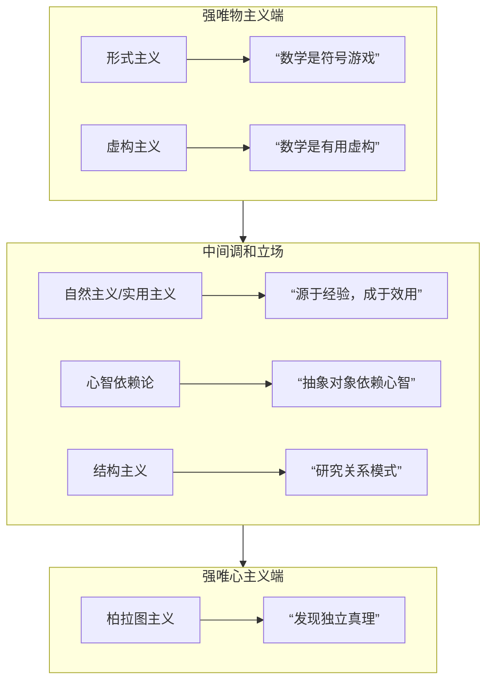

# 哲学笔记：数学的本质——集合、隐喻与唯物唯心之辨

## 一、核心问题
数学中的“集合”概念，在哲学上是否是一种**本体论隐喻**？由此延伸，数学的本质究竟是**唯物**的还是**唯心**的？

## 二、集合作为本体论隐喻

### 1. 理论基础
- **本体论隐喻**（莱考夫 & 约翰逊）：用“物体”、“容器”等具体经验理解抽象概念
- **示例**：将“时间”理解为可“省”、可“花”的实体资源

### 2. 集合的隐喻性特征
| 隐喻维度 | 具体表现 | 哲学意义 |
|---------|---------|---------|
| **具体化** | 将抽象的“总体”实体化为独立数学对象 | 使模糊的聚合概念获得本体论地位 |
| **容器图式** | 元素“在集合中”→韦恩图的圆圈容器 | 源于物理世界的空间经验 |
| **可操作性** | 并、交、补运算→容器的合并、重叠、切割 | 允许对抽象概念进行符号化操作 |

### 3. 认知根源与哲学价值
- **发生学起源**：源于对物理对象的收集分类经验
- **解决柏拉图主义困境**：为数学对象提供基于身体经验的构建论解释
- **悖论的启示**：罗素悖论暴露了无限制实体化带来的问题，需公理化约束

## 三、数学的唯物-唯心光谱

### 哲学立场分布图


### 各立场核心主张对比

| 立场 | 本体论主张 | 认识论主张 | 优势 | 局限 |
|------|-----------|-----------|------|------|
| **形式主义** | 数学对象不存在，只是符号 | 真理由系统一致性定义 | 避免抽象实体难题 | 无法解释数学的应用有效性 |
| **虚构主义** | 数学是连贯的虚构故事 | “故事内”为真 | 保持本体论简洁性 | 削弱数学的客观性 |
| **自然主义** | 根植于物质世界经验 | 由科学应用的有效性验证 | 连接数学与科学实践 | 难以解释纯数学的先验性 |
| **心智依赖论** | 抽象对象依赖心智存在 | 构造但受逻辑约束 | 调和客观性与人类中心性 | 模糊了依赖的具体机制 |
| **结构主义** | 研究普遍关系结构 | 发现结构的实例化 | 避免单个对象的本体论 | 结构本身地位仍存疑 |
| **柏拉图主义** | 数学对象独立实存 | 心智发现先验真理 | 保证数学的客观必然性 | 面临认识论通道难题 |

## 四、超越二分：一个综合性理解

### 1. 数学的双重特性
- **看似唯心**：对象抽象、真理先验、逻辑自主
- **实为唯物**：源于实践、经验验证、改造世界

### 2. 作为“桥梁”的数学
```
物质世界（稳定模式）
    ↑
    | 互动生成
    ↓
人类心智（认知结构）
    ↑
    | 理性构造
    ↓
数学系统（自主领域）
    ↑
    | 应用反馈
    ↓
物质世界（解释预测）
```

### 3. 动态生成观
数学是人类**心智结构**与**世界结构**在历史实践中：
1. **相互作用**的产物
2. **理性构造**的体系
3. **具有客观约束**的认知成果

## 五、关键启示

1. **集合的隐喻本质**：揭示了数学概念与身体经验的深刻联系，挑战了纯粹先验的数学观

2. **光谱而非二元**：唯物与唯心构成解释光谱，多数现代理论寻求中间道路

3. **有效性的奇迹**：数学在物质世界中的“无理性有效性”是任何哲学理论必须面对的核心谜题

4. **实践的核心地位**：无论是数学的起源、发展还是验证，物质与心智的**实践互动**都是关键环节

## 六、开放问题

1. 如果数学是人类认知的构造，为何不同文化会趋同于相似的数学体系？
2. 数学真理的必然性究竟源于逻辑本身，还是源于世界与心智的共同结构？
3. 未来人工智能的发展（可能产生非人类数学直觉）会如何改变我们对数学本质的理解？

---

**结语**：数学或许既不是纯粹对客观理念的发现，也不是完全主观的任意发明，而是在**主客互动中生成**的、具有高度自主性的理性秩序。这种生成性视角，让我们既能欣赏数学那仿佛来自另一世界的纯粹之美，又能理解它扎根于我们与世界打交道的最日常经验。